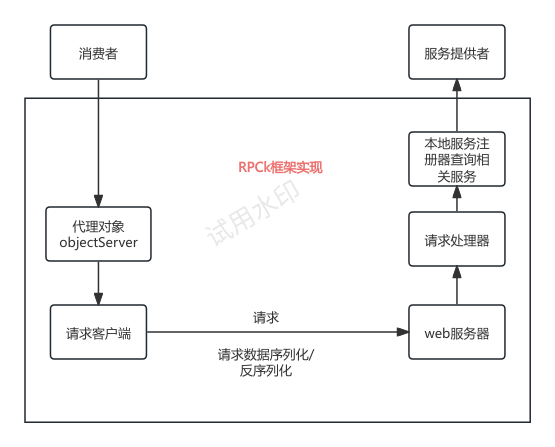

# 手写RPC框架学习

## 什么是RPC

RPC(Remote Procedure Call)从字面意思就是远程程序请求, 我的理解就是, 将能够分离的服务进行解耦合, 暴露出接口, 让其他服务能够通过网络直接请求调用. 能够降低服务之间的耦合度, 防止崩溃, 同时提高服务的可维护程度.

通过RPC框架甚至不需要构建http请求, 相当与是RPC框架提供了一个方法, 隐藏了构建http请求的过程, 只需要关注传入的参数, 和传回的数据就足够了.



## 关于RPC的一些问题

目前我理解的RPC框架相当于是一个引入的包, 通过调用相关的方法就能够直接访问相关的服务, 当然对于服务方应该也是使用相同的协议的.

写RPC框架就像是在写一个现成的包一样, 其他服务通过应用这个包, 然后使用这个包中的工具, 就可以实现RPC的功能.

## yu-RPC简易版

### 初始化结构

构建了四个模块exam-consumer,exam-provider, example-common, yu-rpc-easy. 取模拟三个端口, 其中的common模块相当于是公共模块,  使用rpc框架构成服务, 在消费者和生产者之间提供桥梁, 相当与中间注册机. 

### common

模块中编写User类实现Serializable接口, 该接口包含了 将数据进行序列化的方法, 节省开发时间.

在接口服务中定义getUser接口,

### 关于Java的一些包

#### lombok

​	lombok会提供一些代码的模板, 通过调用相关的注解自动生成一些方法. 在Java开发中, 会统一为一个方法开发set和get方法, 但是这些方法其实比较固定, 只需要固定生成就行, 通过应用lombok包中的@Getter等注解就可以快速生成.

#### hutool

​	hutool就相当一个工具包, 集成了许多可以用到的工具, 方便开发, 提升开发者的开发效率.

### RPC框架中provider方面

RPC服务中, 其实是否为privider提供创建服务器, 觉得可能还是很重要的, 为的就是有一个统一的协议.

注册中心和本地注册器的区别. 本地注册器是用于管理本地的注册方法的, 接受请求,分析请求的方法然后调用处理. 注册中心的作用是将获得的请求, 转发给合适的provider.

本项目中用到了很多Vertx框架下的知识, 对该框架还并不是非常熟悉. 

​	要注意RPC框架是提供给开发者使用的，不论是consumer还是provider,都是开发者，其作用只是将两个服务解耦，而非是产品服务。通过在开发中，双方引入common模块，将一些注册信息。
​	consumer通过RPC框架提供的方法将参数包装成请求，通过common中提供的一些注册信息选择服务。provider解析到本地注册器，处理完数据后，通过response返回数据。

### 全局配置的添加

在RPC框架包中添加, 配置文件.properties, 同时定义一个相应的.class对象接收它. 在RpcApplication中定义了一个全局变量(volatile) RpcConfig. 同时定义了两个init方法, 分别代表默认配置和自定义配置. 再定义了一个getConfig的方法, 获取config. 这些变量和方法都是static类型, 当包引用时就可以直接调用, 无需创建相关的的.class对象.

### mock服务的添加

#### 目前我理解的mock服务

其实在api测试中也已经用到了mock. 当时相当于是接口需要构造相关的请求, 填写参数, 然后模拟正常的接口请求. 在RPC中的mock估计远不止于此. 由于是一个服务向另一个服务发送请求, 当另一个服务还没有开发完成的时候, 直接通过RPC向其请求肯定是没有用的. 但是RPC框架带来的, 就是只需要关注参数和返回, 而不需要具体的实现. 只需要能够模拟参数和返回即可. mock相当于就是构造了一个接收和返回的功能. 其返回的数据是, 预期中正确的示例数据.  主要作用是为了能够测试当前编写的模块能否正常运行.

### 关于consumer端的服务代理

RPC框架相当于是consumer与provider之间协商的一个协议. 两者都会应用common模块. 在common模块中, 包含这一些接口. 不同的是, 对于provider需要实现这些抽象类的接口, 而consumer是直接调用这其中的接口.
光有包含接口的模块肯定是无法运行的, 所以需要相关的实现类. 但是如果直接将provider编写的Impl粘贴过来也就不需要RPC了. 所以在consumer端需要的是编写代理类去实现这个接口, 也就是在consumer端, 这个接口的实现不会是处理相关的数据, 而只是构造了一个网络请求, 将参数发送到provider那去.

#### 静态请求

就是直接根据信息构造请求, 但是这样做的话工作量太大. 应该将能够固定程式化的部分尽可能的固定.比如用户只需要关注传入参数即可. 
对于一个请求最重要的无非一下几点

1. 服务提供商的相关信息
2. 需要调用的服务名称
3. 提供的参数

返回的结果为

1. 返回数据的类型
2. 返回的数据

所以将返回的数据正确绑定会数据类型即可.
这样就完成了一次服务代理.
服务请求商的信息由config文件提供, 调用服务的名称由用户输入, 在common模块中, 参数有用户提供.中间请求的构造, 有proxy类实现. 

### java SPI

应该可以认为是java开发者中默认的一种开发模式. 所以在使用maven创建的项目中, ServiceLoader会自动加载在resources/META-INF下的的service文件. 当然加载的是引入依赖jar包下的配置文件.

要注意Serializer只是其中的一个包, 可以通过加载不同类型的SPI包, 进行调用.

### 序列化器与SPI总结

使用不同的序列化器可以获得不同的性能, 使用者可以根据业务需求调用不同的序列化器进行传输数据.
通过一个SPILoader将所有SPI接口载入, 再通过相关配置文件读取到实现类存储的路径, 将其class文件加载进map中, 通过在具体使用时, 通过反射, 将其实例化,进行调用.

### 一个小bug

在编写的时候会使用到一个注解`@slf4j`这是一个日志库, 用于快速的编写一些日志语句. 但是需要在项目中引入包, 但是在项目中一开始我引入的是`slf4j-api`, 其实就只是引入了接口, 还需要引入相关的实现包对接口进行实现.

## 注册中心

同一个服务, 可以有不同的提供者, 一方面可以减轻服务提供者的压力, 另一方面也可以根据选择不同服务者, 保障服务的稳定.

其本质就是要在发送RPC请求时, 确认, 应该将这个请求发送给谁. 通过询问注册中心, 进行合理的请求.

对于etcd的管理, 和mysql有点不一样. 其本质就是一个大型的树形结构. 这个树形结构只在叶子节点存储数据. 同时就它提供的几个操作脚本也让我觉得它的操作逻辑有点不一样. etcd脚本只是启动了相关的服务, 而需要使用etcdctl脚本进行交互, 还有一个脚本进行测试好像. 和其他服务启动后会有个 shell不是很一样. 感觉也体现了它的轻量化吗?

在使用jetcd操作时, 一开始的逻辑有些让我看不懂. 

```java
private Client client;
private KV kvClient;
```

两个client属实让我没有见过. 因为一般服务都是直接通过不同的命令进行不同的功能的. 通过仔细阅读下面的代码才能理解其中一二.

```java
	/**
     * 创建一个etcd的client端与etcd服务端进行交互
     * 这个client相当于是一个总的交互客户端. 和其设计思路有关.
     * 比如直接通过etcd启动的就是服务, 而需要通过etcdctl脚本才能进行值交互.
     * 通过client获取kvclient, leaseclient这些特殊工作的client
     */
    private Client client;

    /**
     * 由于很多的方法都需要使用到kvclient(应该也就是设置键值对的交互client)所以选择将这个client设置成了一个类变量
     */
    private KV kvClient;

/**
*从这个init中可以看出, client相当于是一个交互的总窗口, 可以通过这个交互窗口创建不同功能的代理.
*/
	@Override
    public void init(RegistryConfig registryConfig) {
        client = Client.builder().endpoints(registryConfig.getAddress())
                .connectTimeout(Duration.ofMillis(registryConfig.getTimeout())) //使用Duration将Long转化为Millis单位毫秒
                .build();
        kvClient = client.getKVClient();
    }
```

